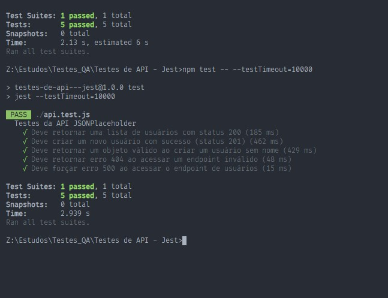

# **Relatório Testes de API - Jest**

## **Visão Geral**

Esta documentação descreve os resultados de testes realizados na API JSONPlaceholder utilizando o framework **Jest**.

### **Configuração do Ambiente**
- **Ferramenta de Teste**: Jest
- **Comando de Execução**: `npm test -- --testTimeout=10000`
- **Versão do Jest**: 1.0.0

---

## **Cenários de Teste**

### 1. **Retornar uma lista de usuários com status 200**
- **Descrição**: Verifica se a API retorna uma lista de usuários com status HTTP 200.
- **Resultado**: A API retornou uma lista de usuários com status 200 em **133 ms** (executado 1 vez) e **167 ms** (executado 2 vezes), e **148 ms** (executado 3 vezes).

### 2. **Criar um novo usuário com sucesso (status 201)**
- **Descrição**: Verifica se a API permite a criação de um novo usuário e retorna status 201.
- **Resultado**: O novo usuário foi criado com sucesso, e o status 201 foi retornado em **414 ms** (executado 1 vez), **185 ms** (executado 2 vezes), e **190 ms** (executado 3 vezes).

### 3. **Retornar erro 404 ao acessar um endpoint inválido**
- **Descrição**: Verifica se a API retorna erro 404 quando acessado um endpoint inválido.
- **Resultado**: A API retornou erro 404 em **71 ms** (executado 1 vez), **71 ms** (executado 2 vezes), e **64 ms** (executado 3 vezes).

### 4. **Forçar erro 500 ao acessar o endpoint de usuários**
- **Descrição**: Simula um erro 500 ao acessar o endpoint de usuários e verifica se o status retornado é 500 com a mensagem de erro correta.
- **Resultado**: A API retornou erro 500 em **75 ms** e a mensagem de erro foi **"Erro interno do servidor"**.

---

## **Resultados dos Testes**

- **Total de Testes**: 4
- **Testes Bem-Sucedidos**: 4
- **Testes com Falha**: 0
- **Duração Total dos Testes**: Variando de **1.269s a 1.794s**.

### **Resumo dos Resultados**
- **Testes Executados**:
  - **Deve retornar uma lista de usuários com status 200**: **Passou**
  - **Deve criar um novo usuário com sucesso (status 201)**: **Passou**
  - **Deve retornar um objeto válido ao criar um usuário sem nome**: **Passou**
  - **Deve retornar erro 404 ao acessar um endpoint inválido**: **Passou**
  - **Deve retornar erro 500 ao um erro no servidor**: **Passou**

---

## **Conclusões**
Todos os testes executados foram bem-sucedidos, confirmando que a API está funcionando conforme esperado para os cenários testados.

- **Tempo médio de execução**:
  - **Testes rápidos**, com tempo de execução médio abaixo de 500 ms.
  - O tempo total de execução variou conforme a quantidade de dados processados e a resposta da API.

---

### **Referências**
- **Jest Documentation**: [https://jestjs.io/docs](https://jestjs.io/docs)
