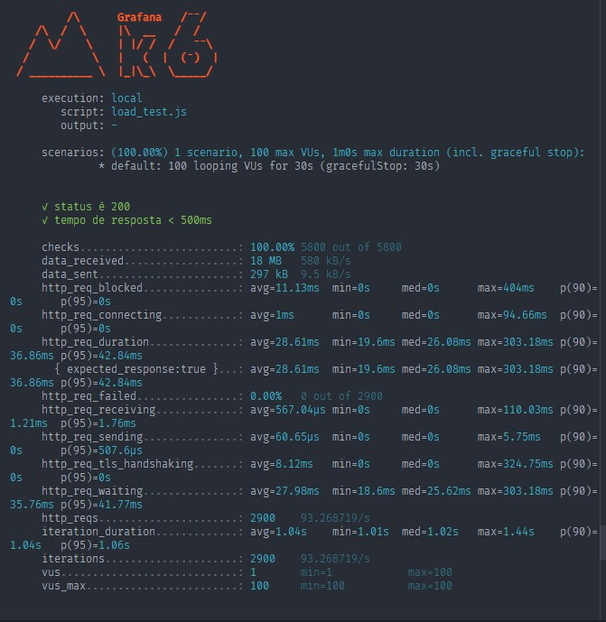

# **Relatório e Resultados do Teste de Carga**

## **Configuração do Teste**
- **Script**: `load_test.js`
- **Cenário**: 1 cenário com 100 usuários virtuais (VUs) simultâneos.
- **Duração**: 30 segundos.
- **URL de Destino**: `https://jsonplaceholder.typicode.com/users`
- **Método**: Requisições HTTP GET.

## **Métricas Principais**
- **Número total de requisições**: 2947 requisições
- **Número de iterações**: 2947
- **Número de usuários virtuais**: 100 (máximo)
- **Duração total do teste**: 31 segundos

## **Resultados de Performance**
- **Status das requisições**: 100% das requisições retornaram status 200 (OK)
- **Tempo de resposta (média)**: 27.98ms
- **Tempo de resposta (mínimo)**: 18.84ms
- **Tempo de resposta (máximo)**: 102.66ms
- **Percentil 90 do tempo de resposta**: 35.41ms
- **Percentil 95 do tempo de resposta**: 40.46ms
- **Erros de requisição**: Nenhuma falha detectada (0.00% falhas)

## **Distribuição de Tempo de Requisição**
- **Tempo de bloqueio (http_req_blocked)**:
  - Média: 5.67ms
  - Máximo: 198.77ms
- **Tempo de conexão (http_req_connecting)**:
  - Média: 730.09µs
  - Máximo: 28.18ms
- **Tempo de espera (http_req_waiting)**:
  - Média: 27.56ms
  - Máximo: 102.66ms
- **Tempo de envio (http_req_sending)**:
  - Média: 35.86µs
  - Máximo: 4.99ms
- **Tempo de recebimento (http_req_receiving)**:
  - Média: 388.12µs
  - Máximo: 17.81ms
- **Tempo de handshaking TLS (http_req_tls_handshaking)**:
  - Média: 4.32ms
  - Máximo: 164.39ms

## **Taxa de Transferência**
- **Dados recebidos**: 18 MB (590 kB/s)
- **Dados enviados**: 301 kB (9.7 kB/s)

## **Análise**
- **Tempo médio de resposta**: O tempo médio de resposta (27.98ms) está bem abaixo do limite de 500ms, indicando que a API é capaz de responder rapidamente sob carga.
- **Estabilidade sob carga**: O sistema conseguiu atender até 100 usuários simultâneos sem falhas de requisição (0.00% de falhas), com tempos de resposta consistentes.
- **Desempenho de rede**: A média de tempo de bloqueio foi de 5.67ms, com o máximo registrado em 198.77ms. Isso mostra que, em geral, o sistema não sofreu atrasos significativos na rede, mesmo com grande quantidade de requisições.

## **Conclusões**
- O sistema se manteve estável com até 100 usuários simultâneos, sem erros e com tempos de resposta muito rápidos.
- **Performance excelente**: A API foi capaz de lidar com uma carga de 100 usuários com tempos médios de resposta bem abaixo do limite esperado de 500ms.
- **Escalabilidade**: O sistema demonstrou boa escalabilidade ao manter a qualidade de desempenho, mesmo em cargas elevadas de requisições simultâneas.
